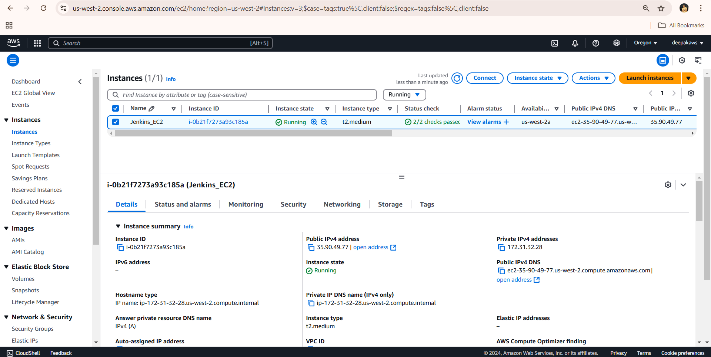
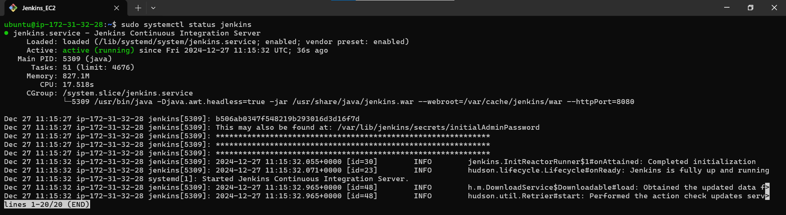
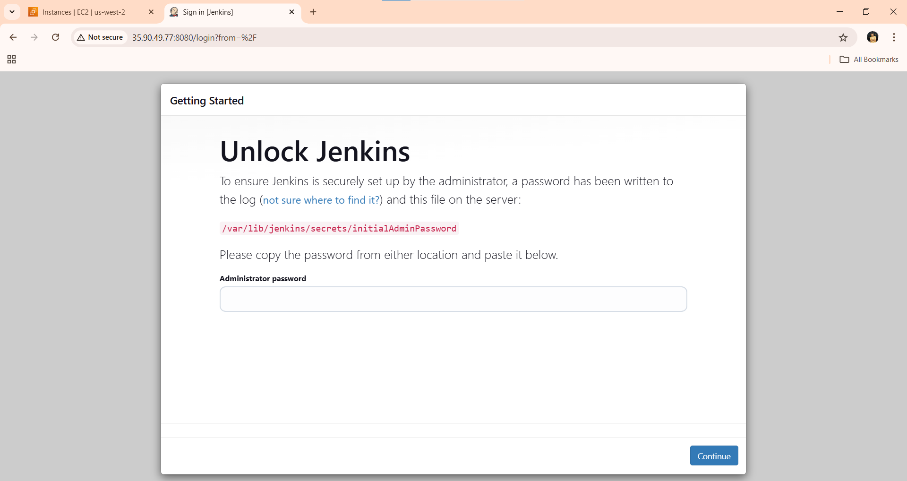
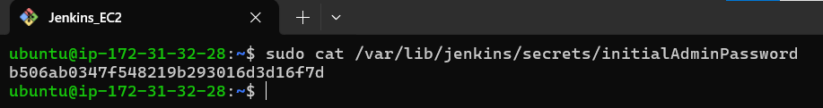
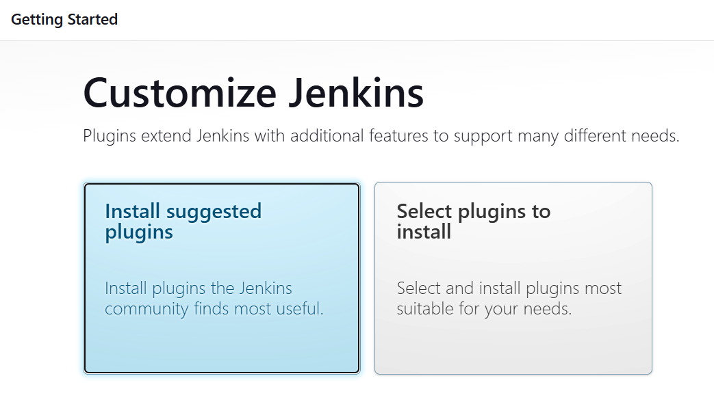
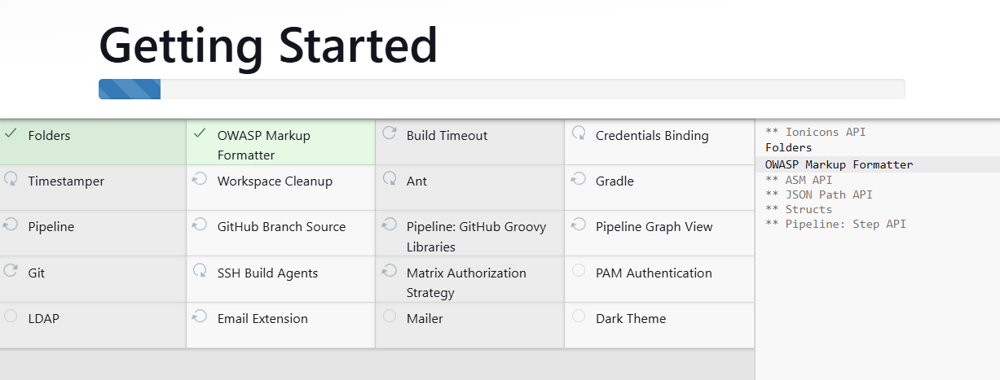
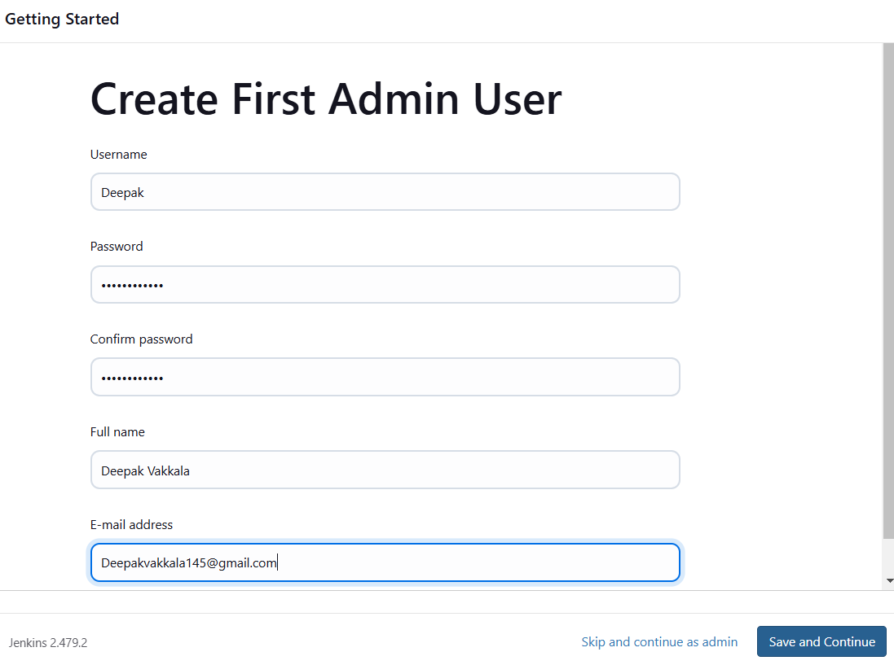
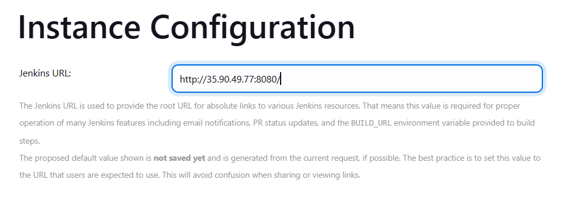
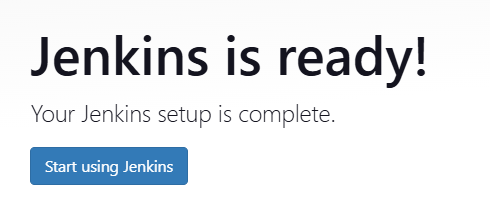
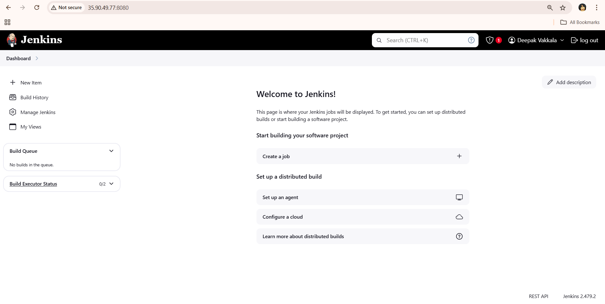

# Installing Jenkins on AWS EC2 Instance

This guide provides detailed steps to set up Jenkins on an AWS EC2 instance, including configuring ports and inbound rules.

---

## Prerequisites

Before you begin, ensure you have:

1. An AWS account.
2. AWS CLI installed and configured.
3. SSH access to the EC2 instance.
4. Basic knowledge of Jenkins.

---

## Steps for Installation

### Step 1: Launch an EC2 Instance

1. Log in to the [AWS Management Console](https://aws.amazon.com/console/).
2. Navigate to the **EC2 Dashboard**.
3. Click **Launch Instances** and provide the following details:
   - **AMI**: Ubuntu server
   - **Instance Type**: t2.medium
   - **Key Pair**: Select an existing key pair or create a new one for SSH access.
   - **Security Group**: Create a new security group or use an existing one:
     - Add an inbound rule for SSH (port 22).
     - Add an inbound rule for HTTP (port 8080).
4. Click **Launch Instance** to create the instance.



---

### Step 2: Connect to the EC2 Instance

1. Open your terminal and connect to the EC2 instance via SSH:
   ```bash
   ssh -i "your-key.pem" ec2-user@your-ec2-public-ip
   ```

2. Update the system packages:
   ```bash
     sudo apt-get update
   ```


---

### Step 3: Install Java

Jenkins requires Java to run. Install it with the following command:

```bash
    sudo apt-get install openjdk-17-jdk -y
```

Verify the installation:

```bash
    java --version
```

### Step 4: Add Jenkins Repository and Install Jenkins

1. Add the Jenkins repository to your system:
   ```bash
      sudo wget -O /usr/share/keyrings/jenkins-keyring.asc \
      https://pkg.jenkins.io/debian-stable/jenkins.io-2023.key
      echo "deb [signed-by=/usr/share/keyrings/jenkins-keyring.asc]" \
      https://pkg.jenkins.io/debian-stable binary/ | sudo tee \
      /etc/apt/sources.list.d/jenkins.list > /dev/null
   ```
   or simply search for [Jenkins Installation Page](https://www.jenkins.io/doc/book/installing/linux/)

2. Install Jenkins:
   ```bash
   sudo apt-get update
   sudo apt-get install jenkins -y
   ```

3. Start and enable the Jenkins service:
   ```bash
   sudo systemctl enable jenkins
   sudo systemctl start jenkins
   sudo systemctl status jenkins
   
   ```


---

### Step 5: Configure Security Group for Jenkins

1. Navigate to the EC2 Dashboard in the AWS Management Console.
2. Select your instance and click on **Security Groups**.
3. Add the following inbound rules to the associated security group:
   - **HTTP**: Port 8080, Source: 0.0.0.0/0 (or restrict to your IP).
   - **SSH**: Port 22, Source: Your IP address.


---

### Step 6: Access Jenkins Web Interface

1. Open your browser and navigate to:
   ```
   http://your-ec2-public-ip:8080
   ```


2. Unlock Jenkins:
   - Get the initial admin password by running:
     ```bash
     sudo cat /var/lib/jenkins/secrets/initialAdminPassword
     ```


   - Copy the password and paste it into the Jenkins setup wizard.

3. Follow the setup wizard to complete the installation:
   - Install suggested plugins.
   - Create an admin user.
   - Configure Jenkins settings.




---

### Step 7: Verify Jenkins Installation

1. After completing the setup, the Jenkins dashboard should be accessible.
2. Test creating and running a simple pipeline job to confirm Jenkins is working correctly.





---

## Explanation

Jenkins is an open-source automation server used to build, deploy, and automate projects. By hosting it on an EC2 instance, you can leverage AWS’s scalable infrastructure while maintaining control over your CI/CD pipelines.

---

## Troubleshooting

1. **Jenkins not accessible on port 8080:**
   - Verify the security group rules.
   - Ensure the Jenkins service is running (`sudo systemctl status jenkins`).

2. **Connection issues:**
   - Check your key pair file and SSH command.
   - Verify the instance’s public IP address.

---

## Conclusion

By following this guide, you have successfully installed Jenkins on an AWS EC2 instance. You can now begin creating and managing CI/CD pipelines for your projects.
