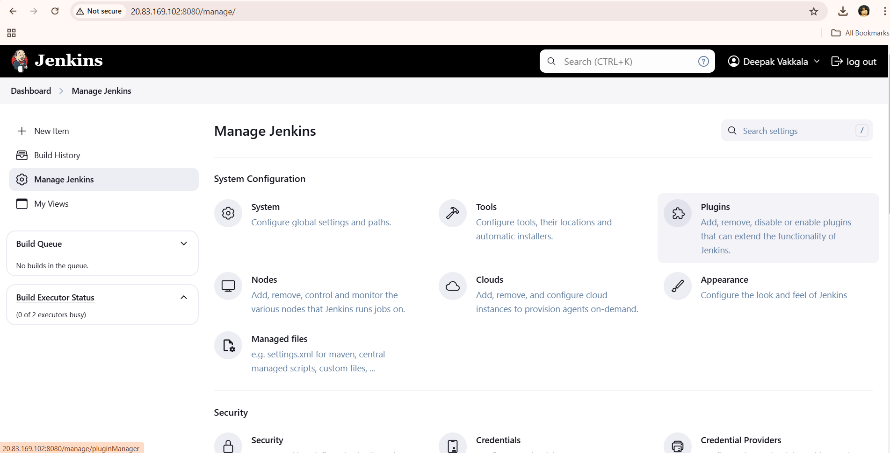
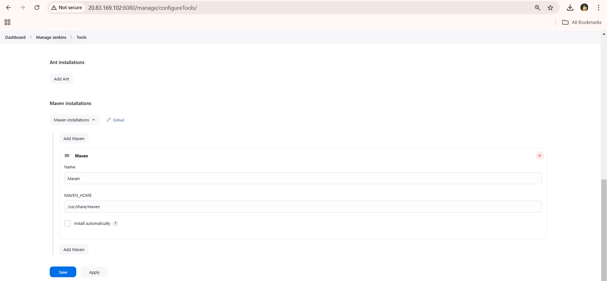
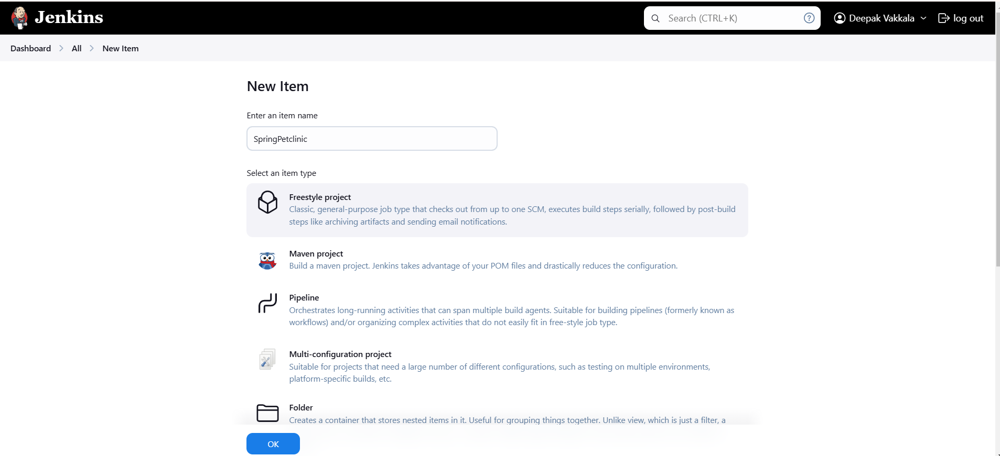
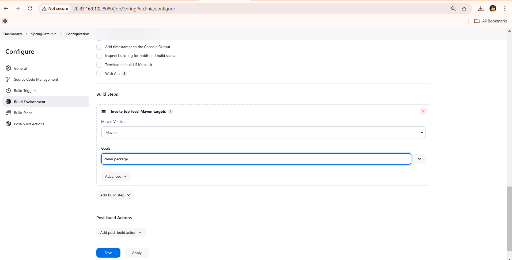
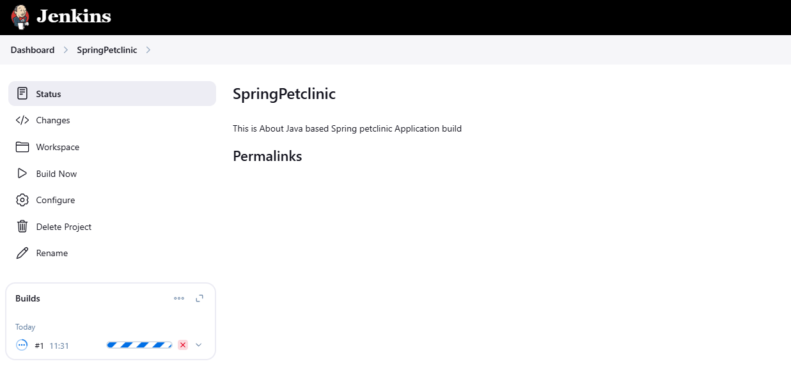
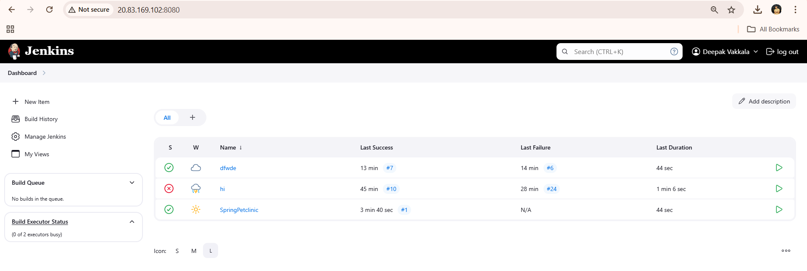
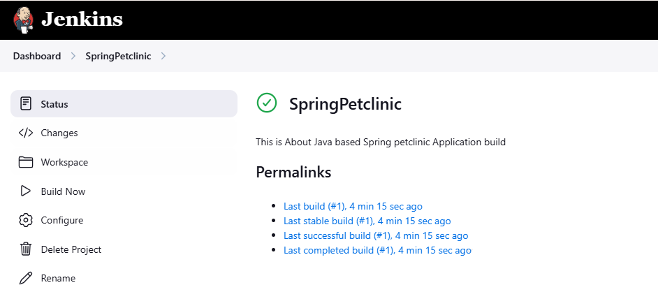
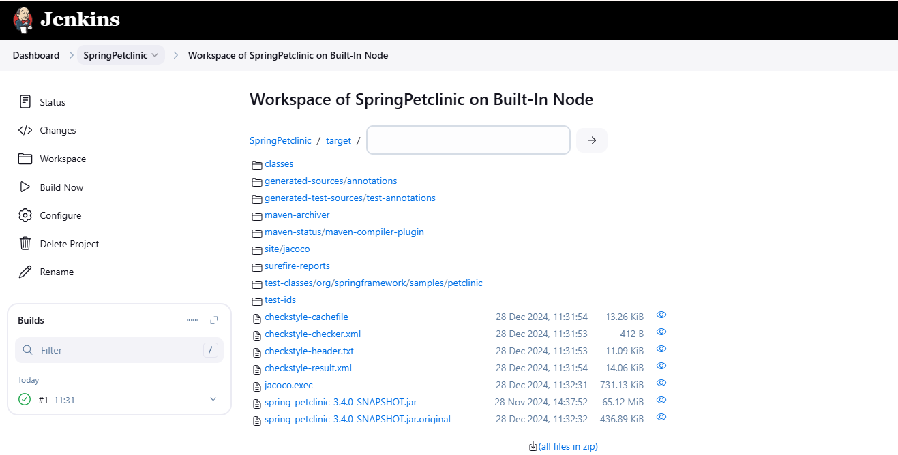

# Building a Java Application in Jenkins

This guide provides detailed steps to set up and build a Java application using Jenkins. It covers everything from installation to deployment, complete with images for better understanding.

---

## Prerequisites

1. **Jenkins Installed:** Ensure Jenkins is installed and running. If not, follow the [Jenkins Installation Guide](https://github.com/DeepakVakkalaDevOpsMutliCloud/Jenkins/blob/main/InstallJenkins/Jenkins.md).
2. **JDK Installed:** Install JDK on your system. Jenkins needs it to build Java projects.
3. **Maven Installed:** Install Apache Maven for building the Java application.
4. **Git Installed:** Git is required for source code management.
5. **Java Application Source Code:** The application source code should be available in a Git repository.

---

## Setting Up Jenkins

### Step 1: Install Plugins
1. Navigate to **Manage Jenkins** > **Manage Plugins**.
2. Install the following plugins:
   - **Git Plugin**
   - **Pipeline Plugin**
   - **Maven Integration Plugin**

  

### Step 2: Configure Tools
1. Go to **Manage Jenkins** > **Global Tool Configuration**.
2. Add the following tools:
   - **JDK:** Specify the installation path.
   - **Maven:** Set up Maven with the installation path.

   
---

## Creating the Pipeline

### Step 1: Create a New Pipeline Job
1. On the Jenkins dashboard, click **New Item**.
2. Select **Pipeline** and provide a name for the job.
3. Click **OK**.

    
  
### Step 2: Configure the Pipeline
1. Under the **Pipeline** section, choose:
   - **Pipeline script from SCM**.
   - **Git** as the source control management tool.
   - Provide the repository URL and the branch name.
   - set maven as shown in the picture 
   - Apply and save

   

---

## Jenkinsfile Explanation

Create a `Jenkinsfile` in your Git repository with the following content:

```groovy
pipeline {
    agent any
    tools {
        maven 'Maven'
        jdk 'JDK'
    }
    stages {
        stage('Checkout') {
            steps {
                git url: 'https://github.com/spring-projects/spring-petclinic.git', branch: 'main'
            }
        }
        stage('Build') {
            steps {
                sh 'mvn clean install'
            }
        }
        stage('Test') {
            steps {
                sh 'mvn test'
            }
        }
        stage('Package') {
            steps {
                sh 'mvn package'
            }
        }
    }
}
```
  

### Explanation:
- **`agent any`**: Uses any available Jenkins agent.
- **Stages**:
  - **Checkout**: Clones the Git repository.
  - **Build**: Compiles the application.
  - **Test**: Runs unit tests.
  - **Package**: Packages the application into a `.jar` file.

---

## Building and Testing

1. Trigger the build by clicking **Build Now**.
2. Monitor the build progress in the **Build History**.
3. Check the **Console Output** for logs.

  
    

---

## Viewing Results

1. Check the **Workspace** for build artifacts (e.g., `.jar` files).
2. View test results under the **Test Results** tab if available.

    
---

## Troubleshooting


#### Issue: `mvn` not found
***Solution:*** Ensure Maven is correctly installed and configured in Jenkins.

#### Issue: Git repository not accessible
***Solution:*** Check credentials and repository permissions.

## Conclusion

This guide demonstrates how to set up and build a Java application using Jenkins. By following the steps outlined, you have:

- Configured Jenkins with the necessary tools and plugins.
- Set up a pipeline to automate the build, test, and package process.
- Troubleshot common issues encountered during the setup.

Building Java applications using Jenkins pipelines simplifies development workflows, ensuring consistency and reliability. Feel free to expand this pipeline by adding automated deployment steps or integrating with other tools to enhance your DevOps capabilities.